## Grafana Setup

### create a Prometheus Datasource inside Grafana Dashboard

 Add Prometheus as a data source in Grafana.

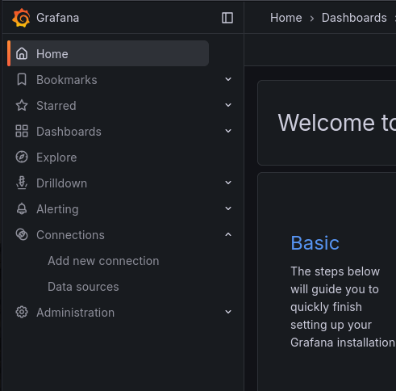

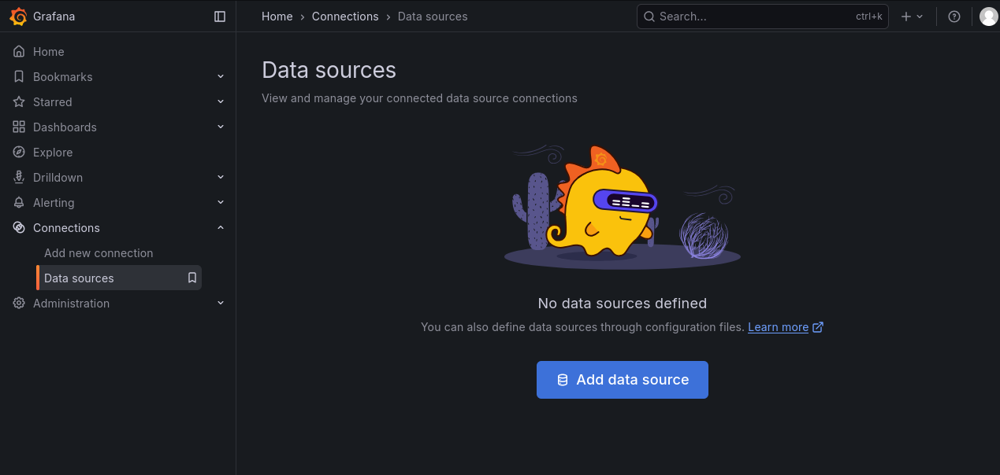

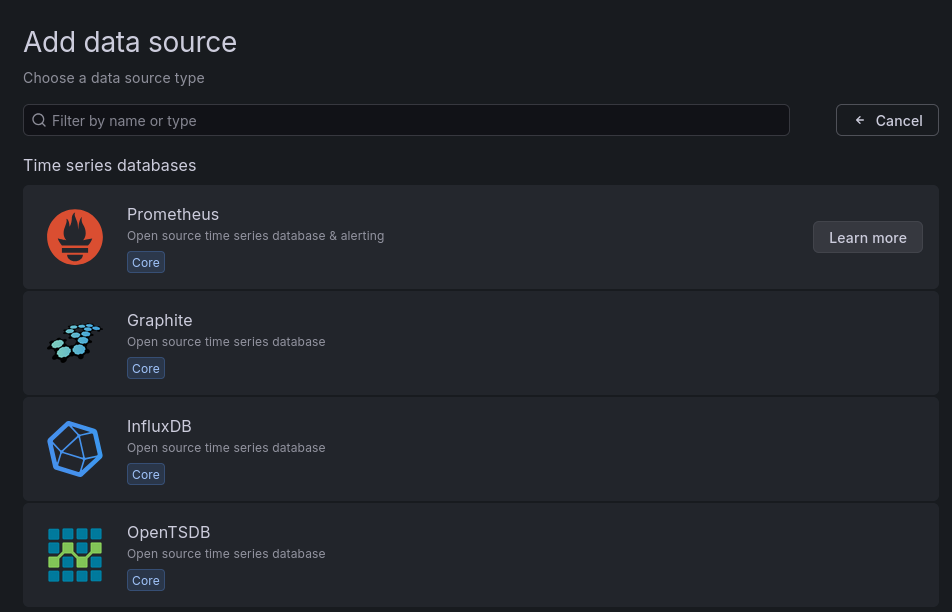

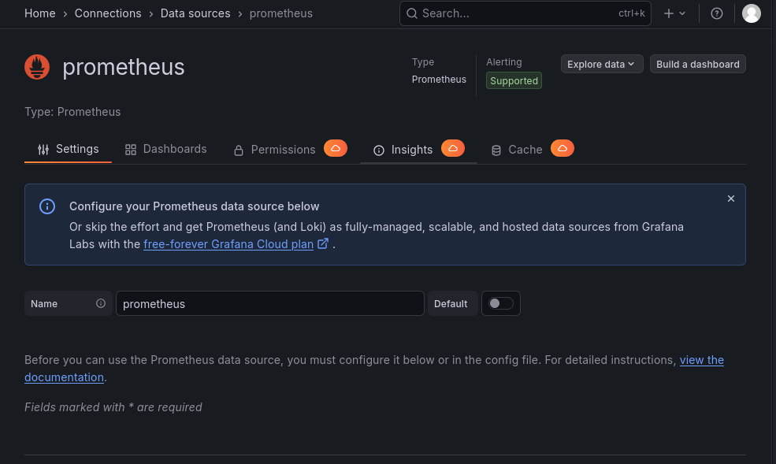

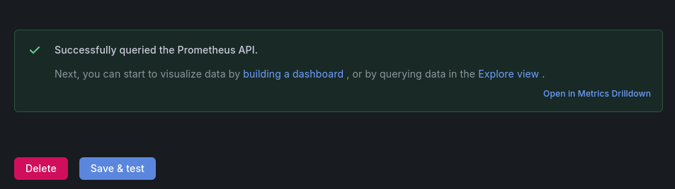

### Import Grafana Dashboard from Grafana Labs

#### Note:
 This project uses Grafana dashboards 1860 for Node Exporter, 13332 fpr cAdvisor, and 1471 for kube-state-metrics to provide full visibility across host, container, and Kubernetes cluster layers.

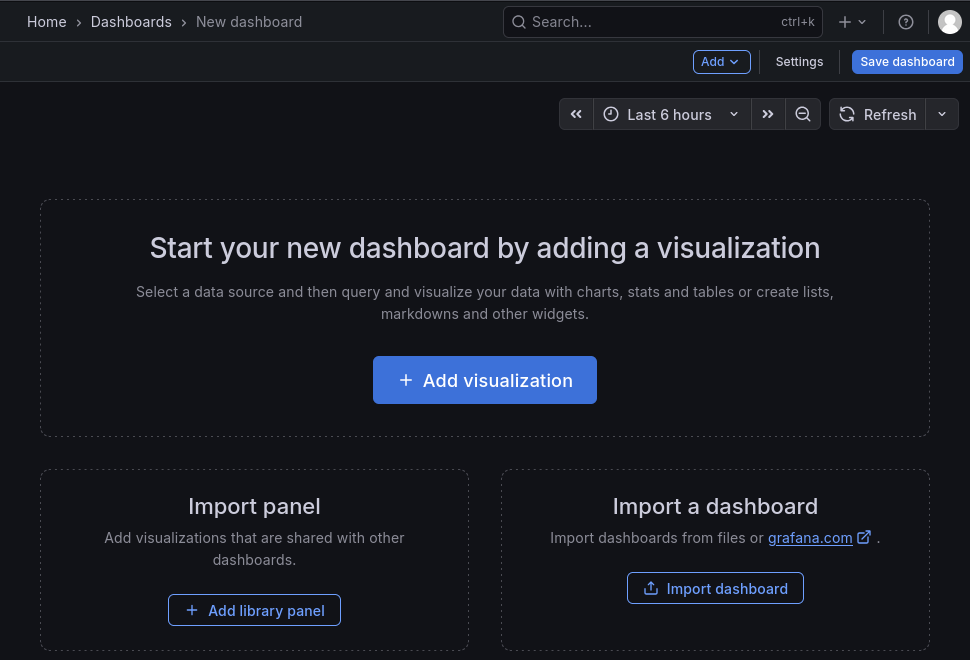

Dashboard ID: 1860

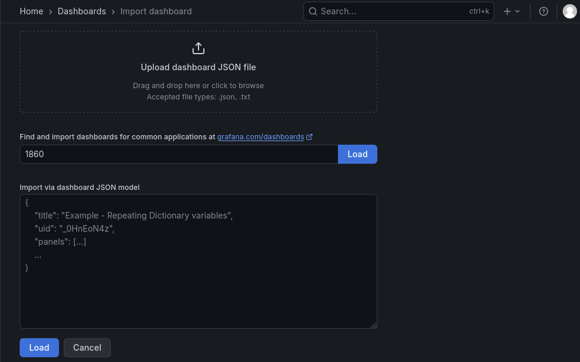

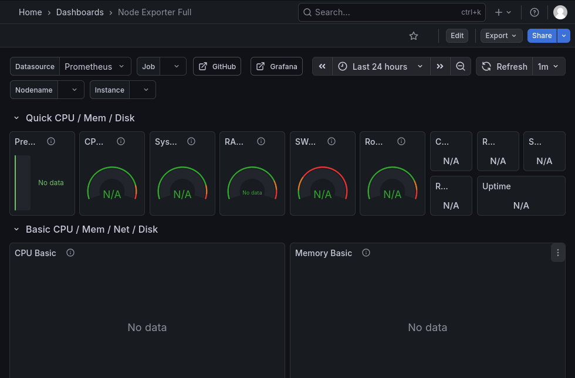

Dashboard ID: 13332

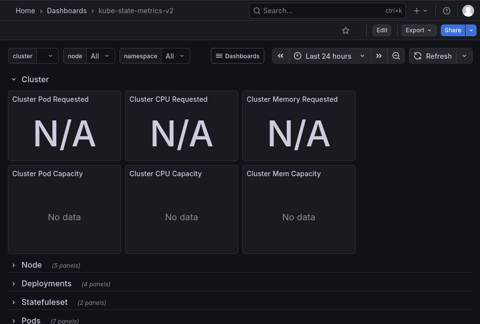

Dashboard ID: 1471

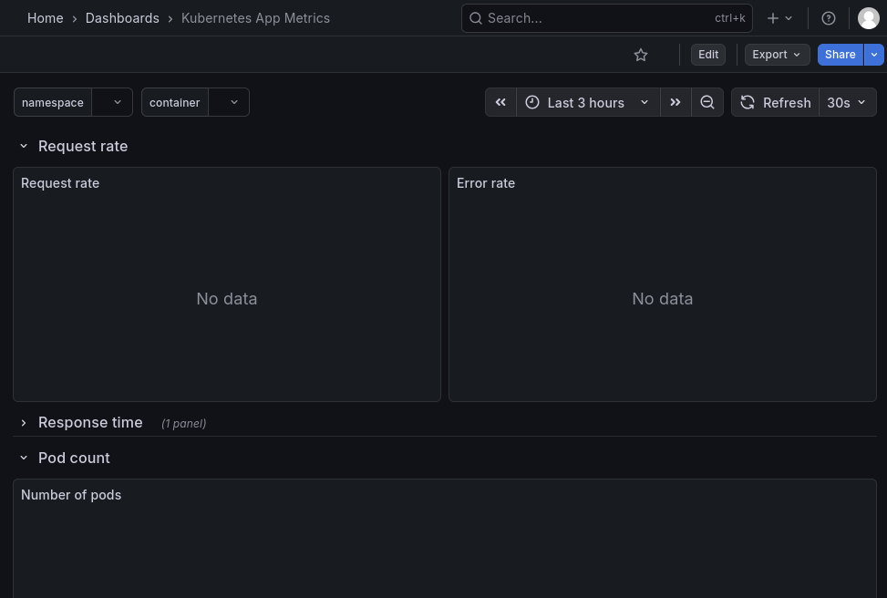

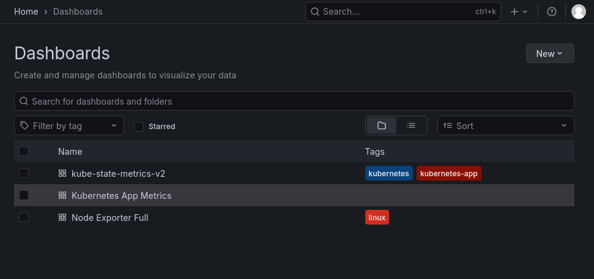